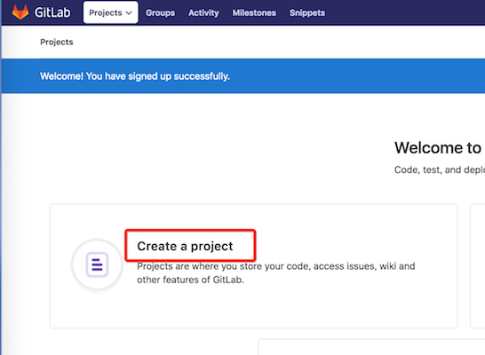

# GitLab安装、使用教程（Docker版）
## 一、下载镜像
官方版本是：gitlab/gitlab-ce:latest
```bash
## 官方镜像，从hub.docker.com拉取
$ docker pull gitlab/gitlab-ce
Using default tag: latest
latest: Pulling from gitlab/gitlab-ce
35b42117c431: Pull complete
ad9c569a8d98: Pull complete
293b44f45162: Pull complete
0c175077525d: Pull complete
c00f43f22198: Pull complete
919116aa9eac: Pull complete
c43ba802d09b: Pull complete
b2785e018405: Pull complete
bcae678431d3: Pull complete
5d91b12e0d65: Pull complete
Digest: sha256:2303e18d40be3ebecd5b0e7ed06361942957b746d83f44f6c191a82eb9abc8fd
## 从hub.docker.com拉取中文版的镜像
$ docker pull beginor/gitlab-ce
Using default tag: latest
latest: Pulling from beginor/gitlab-ce
297061f60c36: Pull complete
e9ccef17b516: Pull complete
dbc33716854d: Pull complete
8fe36b178d25: Pull complete
686596545a94: Pull complete
c9d6b299bcc6: Pull complete
0f4ecbab3b37: Pull complete
98d23afd8106: Pull complete
615484986ecc: Pull complete
5f0363938d34: Pull complete
9522d2cfa31a: Pull complete
45f229198c7d: Pull complete
Digest: sha256:e5d73a0ebc3d80fec2130993c550b9b178ae7c7971c255509e8c9feee4c0bd6b
Status: Downloaded newer image for beginor/gitlab-ce:latest
$ docker images
REPOSITORY                         TAG                 IMAGE ID            CREATED             SIZE
gitlab/gitlab-runner               latest              4142c6fc05d4        5 days ago          410MB
gitlab/gitlab-ce                   latest              15563c211d40        10 days ago         1.8GB
```

## 二、运行GitLab容器
使用docker命令运行容器，注意修改hostname为自己喜欢的名字，-v部分挂载目录要修改为自己的目录。  
端口映射这里使用的都是安全端口，如果大家的环境没有端口限制或冲突可以使用与容器同端口，如：-p 443:443 -p 80:80 -p 22:22

官方文档：https://docs.gitlab.com/omnibus/docker/

#### 1. 生成启动文件 - start.sh
```bash
$ tee start.sh <<-'EOF'
#!/bin/bash
HOST_NAME=gitlab.yourname.com
GITLAB_DIR=`pwd`
docker pull beginor/gitlab-ce
docker stop gitlab
docker rm gitlab
docker run -d \
    --restart always \
    --hostname ${HOST_NAME} \
    -p 8443:443 -p 80:80 -p 2222:22 \
    -v ${GITLAB_DIR}/config:/etc/gitlab \
    -v ${GITLAB_DIR}/logs:/var/log/gitlab \
    -v ${GITLAB_DIR}/data:/var/opt/gitlab \
    --name gitlab \
    beginor/gitlab-ce:latest
EOF
```
#### 2. 运行start.sh 启动gitlab
```bash
## 运行脚本start.sh
$ sh start.sh
Using default tag: latest
latest: Pulling from beginor/gitlab-ce
Digest: sha256:e5d73a0ebc3d80fec2130993c550b9b178ae7c7971c255509e8c9feee4c0bd6b
Status: Image is up to date for beginor/gitlab-ce:latest
gitlab
gitlab
303a0c72af108fd53d737d8dd6ef111e8cd630cfc0483982353e781a958445c1
## 以追踪的方式查看容器的内部实时日志
$ docker logs -f gitlab
Thank you for using GitLab Docker Image!
Current version: gitlab-ce=10.7.5-ce.0
Configure GitLab for your system by editing /etc/gitlab/gitlab.rb file
And restart this container to reload settings.

$ docker ps
CONTAINER ID        IMAGE         COMMAND      CREATED         STATUS             PORTS        NAMES
f3f8b07f6d23        gitlab/gitlab-ce   "/assets/wrapper"   6 minutes ago       Up 6 minutes (healthy)   0.0.0.0:80->80/tcp, 0.0.0.0:2222->22/tcp, 0.0.0.0:8443->443/tcp   gitlab
```

#### 3. 配置环境
* 修改host文件，使域名可以正常解析
> 192.168.1.105 gitlab.your_name.com

* 修改ssh端口（如果主机端口使用的不是22端口）
> 修改文件：${GITLAB_DIR}/config/gitlab.rb
>
> 找到这一行：# gitlab_rails['gitlab_shell_ssh_port'] = 22
>
> 把22修改为你的宿主机端口（这里是2222）。然后将注释去掉。
>
> gitlab_rails['gitlab_shell_ssh_port'] = 2222

* 重新启动容器
```bash
$ sh start.sh
Error response from daemon: No such container: gitlab
Error: No such container: gitlab
06d6c926a907f489f10a37e5c7bbd702aecdff49eb41fed1abf378e113d49d96
```

## 三、GitLab试用
#### 1. 打开首页
地址：http://gitlab.yourname.com/

#### 2. 设置管理员密码
首先根据提示输入管理员密码，这个密码是管理员用户的密码。对应的用户名是root，用于以管理员身份登录Gitlab。  


#### 3. 创建账号
设置好密码后去注册一个普通账号  


#### 4. 创建项目
注册成功后会跳到首页，我们创建一个项目，名字大家随意  


#### 5. 添加ssh key
项目建好了，我们加一个ssh key，以后本地pull/push就简单啦  


首先去到添加ssh key的页面  


然后拿到我们的sshkey 贴到框框里就行啦
怎么拿到呢？看下面：
```bash
#先看看是不是已经有啦，如果有内容就直接copy贴过去就行啦
$ cat ~/.ssh/id_rsa.pub

#如果上一步没有这个文件 我们就创建一个，运行下面命令（邮箱改成自己的哦），一路回车就好了
$ ssh-keygen -t rsa -C "youremail@example.com"
$ cat ~/.ssh/id_rsa.pub
```

#### 6. 测试一下
点开我们刚创建的项目，复制ssh的地址  


添加个文件试试（我的项目叫test）
```bash
#clone代码
$ git clone ssh://git@gitlab.mooc.com:2222/michael/test.git
#写一个文件
$ cd test && echo test > test
#push
$ git add .
$ git commit -m "test"
$ git push origin master
```

去gitlab上看看  


到这我们的gitlab就齐活啦！愉快的使用吧~

#### 7. Command line instructions 

 You can also upload existing files from your computer using the instructions below. 

##### Git global setup

```bash
git config --global user.name "your_name"
git config --global user.email "your_name@example.com"
```

##### Create a new repository

```bash
git clone http://gitlab.your_name.com/your_name/microservice.git
cd microservice
touch README.md
git add README.md
git commit -m "add README"
git push -u origin master
```

##### Push an existing folder

```bash
cd existing_folder
git init
git remote add origin http://gitlab.your_name.com/your_name/microservice.git
git add .
git commit -m "Initial commit"
git push -u origin master
```

##### Push an existing Git repository

```bash
cd existing_repo
git remote rename origin old-origin
git remote add origin http://gitlab.your_name.com/your_name/microservice.git
git push -u origin --all
git push -u origin --tags
```

#### 8. 遇到的问题

```bash
================================================================================
Error executing action `create` on resource 'storage_directory[/var/opt/gitlab/.ssh]'
================================================================================
Running handlers:
There was an error running gitlab-ctl reconfigure:

storage_directory[/var/opt/gitlab/.ssh] (gitlab::gitlab-shell line 38) had an error: Mixlib::ShellOut::ShellCommandFailed: ruby_block[directory resource: /var/opt/gitlab/.ssh] (/opt/gitlab/embedded/cookbooks/cache/cookbooks/package/resources/storage_directory.rb line 33) had an error: Mixlib::ShellOut::ShellCommandFailed: Failed asserting that ownership of "/var/opt/gitlab/.ssh" was git:git
---- Begin output of set -x && [ "$(stat --printf='%U:%G' $(readlink -f /var/opt/gitlab/.ssh))" = 'git:git' ] ----
STDOUT:
STDERR: + readlink -f /var/opt/gitlab/.ssh
+ stat --printf=%U:%G /var/opt/gitlab/.ssh
+ [ UNKNOWN:UNKNOWN = git:git ]
---- End output of set -x && [ "$(stat --printf='%U:%G' $(readlink -f /var/opt/gitlab/.ssh))" = 'git:git' ] ----
Ran set -x && [ "$(stat --printf='%U:%G' $(readlink -f /var/opt/gitlab/.ssh))" = 'git:git' ] returned 1

Running handlers complete
Chef Client failed. 6 resources updated in 08 seconds
```

```bash
解决办法：不要在和主机共享的目录安装就可以解决该问题
```
